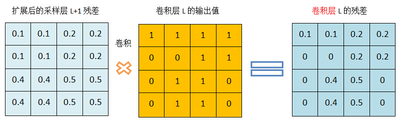

# 深度学习（二）：卷积神经网络

## 前言

### 神经网络的缺陷

不同层之间是全连接的，当神经网络的深度、节点数变大，会导致过拟合、参数过多等问题。

### 计算机视觉（图像）背景

1. 通过抽取只依赖图像里小的子区域的局部特征，然后利用这些特征的信息就可以融合到后续处理阶段中，从而检测更高级的特征，最后产生图像整体的信息。
2. 距离较近的像素的相关性要远大于距离较远像素的相关性。
3. 对于图像的一个区域有用的局部特征可能对于图像的其他区域也有用，例如感兴趣的物体发生平移的情形。

## 卷积神经网络（CNN）特性


1. 局部感知

    图1：全连接网络。如果L1层有1000×1000像素的图像，L2层有1000,000个隐层神经元，每个隐层神经元都连接L1层图像的每一个像素点，就有1000x1000x1000,000=10^12个连接，也就是10^12个权值参数。

    图2：局部连接网络。L2层每一个节点与L1层节点同位置附近10×10的窗口相连接，则1百万个隐层神经元就只有100w乘以100，即10^8个参数。其权值连接个数比原来减少了四个数量级。

2. 权值共享

    就图2来说，权值共享，不是说，所有的红色线标注的连接权值相同。而是说，每一个颜色的线都有一个红色线的权值与之相等，所以第二层的每个节点，其从上一层进行卷积的参数都是相同的。

    图2中隐层的每一个神经元都连接10×10个图像区域，也就是说每一个神经元存在10×10=100个连接权值参数。如果我们每个神经元这100个参数是相同的？也就是说每个神经元用的是同一个卷积核去卷积图像。这样L1层我们就只有100个参数。但是这样，只提取了图像一种特征？如果需要提取不同的特征，就加多几种卷积核。所以假设我们加到100种卷积核，也就是1万个参数。

    每种卷积核的参数不一样，表示它提出输入图像的不同特征（不同的边缘）。这样每种卷积核去卷积图像就得到对图像的不同特征的放映，我们称之为Feature Map，也就是特征图。
    
3. 卷积（Convolution）特征提取

    卷积核（Convolution Kernel），也叫过滤器filter，由对应的权值W和偏置b体现,下图是3x3的卷积核在5x5的图像上做卷积的过程，就是矩阵做点乘之后的和:
    
    
    
    多个过滤器filter（卷积核）:
    
    
    
    一张图片有RGB三个颜色通道，则对应的filter过滤器也是三维的，图像经过每个filter做卷积运算后都会得到对应提取特征的图像，途中两个filter:W0和W1,输出的就是两个图像,这里的步长stride为2（一般就取2,3）;在原图上添加zero-padding，它是超参数，主要用于控制输出的大小。
    
    例子(如下图)：
    与w0[:,:,0]卷积：0x(-1)+0x0+0x1+0x1+0x0+1x(-1)+1x0+1x(-1)+2x0=-2 
    与w0[:,:,1]卷积：2x1+1x(-1)+1x1=2 
    与w0[:,:,2]卷积：1x(-1)+1x(-1)=-2 
    最终结果：-2+2+(-2)+1=-1 (1为偏置) 
    
    
    
4. caffe中RGB图像三通道卷积过程学习推导

    输入的image一般是RGB三通道的彩色图片，但是我们在定义卷积层时一般只指定了一个kernel_size参数。
    
    (1) 图片：一般我们说一张图片的宽度为width：W，高度为height：H，这张图片的的通道数为D，一般目前都用RGB三通道的D=3，但是为了通用性表示为D .
    
    (2) 卷积核：卷积核大小为K\*K，，因为处理的图片是D通道的，因此卷积核其实也就是K\*K\*D大小的，假设有M个卷积核–到这里其实就解决了之前的疑问，RGB三通道，指定了kernel_size的前提下，真正的卷积核大小是kernel_size\*kernel_size*3。
    
    接下来继续讨论caffe是如何实现通道数为D的卷积的,最简单的实现方法，循坏：
    
```
for w in 1..W
  for h in 1..H
    for x in 1..K
      for y in 1..K
        for m in 1..M
          for d in 1..D
            output(w, h, m) += input(w+x, h+y, d) * filter(m, x, y, d)
          end
        end
      end
    end
  end
end
```

    可以看到最内层的循环是针对通道数D的:
    
```
output(w, h, m) += input(w+x, h+y, d) * filter(m, x, y, d)
```

说明对于D各通道而言，是在每个通道上分别执行二维卷积，然后将D个通道加起来，得到该位置的二维卷积输出，对于RGB三通道而言，就是在R,G,B三个通道上分别使用对应的每个通道上的kernel_size\*kernel_size大小的核去卷积每个通道上的W\*H的图片，然后将三个通道卷积得到的输出相加，得到M个二维卷积输出结果，在有padding的情况下，能保持输出图片大小和原来的一样，因此是：output(w, h, m) 。

我们可以将一张图片考虑为矩阵(W\*H, K\*K\*D)，将卷积核考虑为 (M, K\*K\*D)，因此可以用矩阵相乘来实现快速卷积，使用的matlab函数是im2col ，接下来我们仔细的讨论下如何将图片变成矩阵以实现卷积： 
    
    
例子：

输入照片为：32\*32\*3


这是用一个Filter得到的结果，即使一个activation map。(filter 总会自动扩充到和输入照片一样的depth)。当我们用6个5*5的Filter时，我们将会得到6个分开的activation maps，如图所示：


得到的“新照片”的大小为：28\*28*6.其实，每个卷积层之后都会跟一个相应的激活函数（activation functions）：


微观上，假设现在input为7\*7，Filter尺寸为3\*3，最终得到一个5\*5的output。假设，input为7\*7，Filter尺寸为3\*3，stride(步长)为2，最终得到一个3*3的output。总的来说:

Output size=(N-F)/stride +1

当有填充(pad)时，例如对一个input为7\*7进行pad=1填充，Filter为3\*3，stride=1，会得到一个7*7的output。

Output size=(N-F+2*pad)/stride +1

注：0填充(pad)的主要目的是因为我们在前面的图中所示的那样，一直用5*5的Filter进行卷积，会导致体积收缩的太快，不利于特征的提取。

举例说明：


在这里要注意一下1*1的卷积核，为什么呢？

举例：一个56\*56\*64的input，用32个1\*1的卷积核进行卷积(每一个卷积核的尺寸为1\*1\*64，执行64维的点乘操作)，将得到一个56\*56*32的output，看到输出的depth减少了，也就是降维，那么parameters也会相应的减少。

代码：

```
def conv2(X, k):
    x_row, x_col = X.shape
    k_row, k_col = k.shape
    ret_row, ret_col = x_row - k_row + 1, x_col - k_col + 1
    ret = np.empty((ret_row, ret_col))
    for y in range(ret_row):
        for x in range(ret_col):
            sub = X[y : y + k_row, x : x + k_col]
            ret[y,x] = np.sum(sub * k)
    return ret

class ConvLayer:
    def __init__(self, in_channel, out_channel, kernel_size):
        self.w = np.random.randn(in_channel, out_channel, kernel_size, kernel_size)
        self.b = np.zeros((out_channel))

    def _relu(self, x):
        x[x < 0] = 0

    def forward(self, in_data):
        # assume the first index is channel index
        in_channel, in_row, in_col = in_data.shape
        out_channel, kernel_row, kernel_col = self.w.shape[1], self.w.shape[2], self.w.shape[3]
        self.top_val = np.zeros((out_channel, in_row - kernel_row + 1, in_col - kernel_col + 1))
        for j in range(out_channel):
            for i in range(in_channel):
                self.top_val[j] += conv2(in_data[i], self.w[i, j])
            self.top_val[j] += self.b[j]
            self.top_val[j] = self._relu(self.topval[j])
        return self.top_val
```

## 池化（pooling）

也叫做下采样.在通过卷积获得了特征 (features) 之后，下一步我们希望利用这些特征去做分类。理论上讲，人们可以用所有提取得到的特征去训练分类器，例如 softmax 分类器，但这样做面临计算量的挑战。例如：对于一个 96X96 像素的图像，假设我们已经学习得到了400个定义在8X8输入上的特征，每一个特征和图像卷积都会得到一个 (96 − 8 + 1) * (96 − 8 + 1) = 7921 维的卷积特征，由于有 400 个特征，所以每个样例 (example) 都会得到一个 892 * 400 = 3,168,400 维的卷积特征向量。学习一个拥有超过 3 百万特征输入的分类器十分不便，并且容易出现过拟合 (over-fitting)。

为了解决这个问题，首先回忆一下，我们之所以决定使用卷积后的特征是因为图像具有一种“静态性”的属性，这也就意味着在一个图像区域有用的特征极有可能在另一个区域同样适用。因此，为了描述大的图像，一个很自然的想法就是对不同位置的特征进行聚合统计，例如，人们可以计算图像一个区域上的某个特定特征的平均值 (或最大值)。这些概要统计特征不仅具有低得多的维度 (相比使用所有提取得到的特征)，同时还会改善结果(不容易过拟合)。这种聚合的操作就叫做池化 (pooling)，有时也称为平均池化或者最大池化 (取决于计算池化的方法)。

下图显示池化如何应用于一个图像的四块不重合区域。


Pooling的好处:

1. 很明显就是减少参数.
2. Pooling就有平移不变性（(translation invariant).如图feature map是12x12大小的图片，Pooling区域为6x6,所以池化后得到的feature map为2x2,假设白色像素值为1，灰色像素值为0，若采用max pooling之后，左上角窗口值为1 

    

    将图像右移一个像素，左上角窗口值仍然为1 
    
    
    
    将图像缩放之后，左上角窗口值仍然为1 
    
    
    
3. Pooling的方法中average方法对背景保留更好，max对纹理提取更好
4. 深度学习可以进行多次卷积、池化操作

代码：

```
class MaxPoolingLayer:
    def __init__(self, kernel_size, name='MaxPool'):
        self.kernel_size = kernel_size

    def forward(self, in_data):
        in_batch, in_channel, in_row, in_col = in_data.shape
        k = self.kernel_size
        out_row = in_row / k + (1 if in_row % k != 0 else 0)
        out_col = in_col / k + (1 if in_col % k != 0 else 0)

        self.flag = np.zeros_like(in_data)
        ret = np.empty((in_batch, in_channel, out_row, out_col))
        for b_id in range(in_batch):
            for c in range(in_channel):
                for oy in range(out_row):
                    for ox in range(out_col):
                        height = k if (oy + 1) * k <= in_row else in_row - oy * k
                        width = k if (ox + 1) * k <= in_col else in_col - ox * k
                        idx = np.argmax(in_data[b_id, c, oy * k: oy * k + height, ox * k: ox * k + width])
                        offset_r = idx / width
                        offset_c = idx % width
                        self.flag[b_id, c, oy * k + offset_r, ox * k + offset_c] = 1                        
                        ret[b_id, c, oy, ox] = in_data[b_id, c, oy * k + offset_r, ox * k + offset_c]
        return ret
```

## 激活层

1. 在每次卷积操作之后一般都会经过一个非线性层，也是激活层.
2. 现在一般选择是ReLu,层次越深，相对于其他的函数效果较好，还有Sigmod,tanh函数等.
3. sigmod和tanh都存在饱和的问题，如图所示，当x轴上的值较大时，对应的梯度几乎为0，若是利用BP反向传播算法， 可能造成梯度消失的情况，也就学不到东西了.


## 全连接层 Fully connected layer

1. 将多次卷积和池化后的图像展开进行全连接，如下图所示。 


2. 接下来就可以通过BP反向传播进行训练了.

## Dropout 层

如今，Dropout 层在神经网络有了非常明确的功能。上一节，我们讨论了经过训练后的过拟合问题：训练之后，神经网络的权重与训练样本太过匹配以至于在处理新样本的时候表现平平。Dropout 的概念在本质上非常简单。Dropout 层将「丢弃（drop out）」该层中一个随机的激活参数集，即在前向通过（forward pass）中将这些激活参数集设置为 0。简单如斯。既然如此，这些简单而且似乎不必要且有些反常的过程的好处是什么？在某种程度上，这种机制强制网络变得更加冗余。这里的意思是：该网络将能够为特定的样本提供合适的分类或输出，即使一些激活参数被丢弃。此机制将保证神经网络不会对训练样本「过于匹配」，这将帮助缓解过拟合问题。另外，Dropout 层只能在训练中使用，而不能用于测试过程，这是很重要的一点。

参考 Geoffrey Hinton 的论文：Dropout: A Simple Way to Prevent Neural Networks from Overfitting

## 后向传播

1. 卷积层

当一个卷积层L的下一层(L+1)为采样层，并假设我们已经计算得到了采样层的残差，现在计算该卷积层的残差。从最上面的网络结构图我们知道，采样层（L+1）的map大小是卷积层L的1/（scale\*scale），以scale=2为例，但这两层的map个数是一样的，卷积层L的某个map中的4个单元与L+1层对应map的一个单元关联，可以对采样层的残差与一个scale*scale的全1矩阵进行克罗内克积 进行扩充，使得采样层的残差的维度与上一层的输出map的维度一致。

扩展过程：


利用卷积计算卷积层的残差：



代码：

```
def backward(self, residual):
    in_channel, out_channel, kernel_size = self.w.shape
    in_batch = residual.shape[0]
    # gradient_b        
    self.gradient_b = residual.sum(axis=3).sum(axis=2).sum(axis=0) / self.batch_size
    # gradient_w
    self.gradient_w = np.zeros_like(self.w)
    for b_id in range(in_batch):
        for i in range(in_channel):
            for o in range(out_channel):
                self.gradient_w[i, o] += conv2(self.bottom_val[b_id], residual[o])
    self.gradient_w /= self.batch_size
    # gradient_x
    gradient_x = np.zeros_like(self.bottom_val)
    for b_id in range(in_batch):
        for i in range(in_channel):
            for o in range(out_channel):
                gradient_x[b_id, i] += conv2(padding(residual, kernel_size - 1), rot180(self.w[i, o]))
    gradient_x /= self.batch_size
    # update
    self.prev_gradient_w = self.prev_gradient_w * self.momentum - self.gradient_w
    self.w += self.lr * self.prev_gradient_w
    self.prev_gradient_b = self.prev_gradient_b * self.momentum - self.gradient_b
    self.b += self.lr * self.prev_gradient_b
    return gradient_x
```

2. 下采样（池化）层

当某个采样层L的下一层是卷积层(L+1)，并假设我们已经计算出L+1层的残差，现在计算L层的残差。采样层到卷积层直接的连接是有权重和偏置参数的，因此不像卷积层到采样层那样简单。现再假设L层第j个map Mj与L+1层的M2j关联，按照BP的原理，L层的残差Dj是L+1层残差D2j的加权和，但是这里的困难在于，我们很难理清M2j的那些单元通过哪些权重与Mj的哪些单元关联，这里需要两个小的变换（rot180°和padding）：

rot180°：旋转：表示对矩阵进行180度旋转（可通过行对称交换和列对称交换完成）

```
def rot180(in_data):
    ret = in_data.copy()
    yEnd = ret.shape[0] - 1
    xEnd = ret.shape[1] - 1
    for y in range(ret.shape[0] / 2):
        for x in range(ret.shape[1]):
            ret[yEnd - y][x] = ret[y][x]
    for y in range(ret.shape[0]):
        for x in range(ret.shape[1] / 2):
            ret[y][xEnd - x] = ret[y][x]
    return ret
```

padding:扩充

```
def padding(in_data, size):
    cur_r, cur_w = in_data.shape[0], in_data.shape[1]
    new_r = cur_r + size * 2
    new_w = cur_w + size * 2
    ret = np.zeros((new_r, new_w))
    ret[size:cur_r + size, size:cur_w+size] = in_data
    return ret
```


## CNN是如何工作的

1. 看到知乎上的一个回答还不错：https://www.zhihu.com/question/52668301
2. 每个过滤器可以被看成是特征标识符（ feature identifiers）
3. 如下图一个曲线检测器对应的值 

    
    
4. 我们有一张图片，当过滤器移动到左上角时，进行卷积运算 
    
    
    
5. 当与我们的过滤器的形状很相似时，得到的值会很大
    
    
    
6. 若是滑动到其他的部分，可以看出很不一样，对应的值就会很小，然后进行激活层的映射。 
    
    
    
7. 过滤器filter的值怎么求到，就是我们通过BP训练得到的。

### 训练（也就是：什么能让其有效）

下面是神经网络中的一个我尚未提及但却最为重要的部分。阅读过程中你可能会提出许多问题。第一卷积层中的滤波器是如何知道寻找边缘与曲线的？完全连接层怎么知道观察哪些激活图？每一层级的滤波器如何知道需要哪些值？计算机通过一个名为反向传播的训练过程来调整过滤器值（或权重）。

在探讨反向传播之前，我们首先必须回顾一下神经网络工作起来需要什么。在我们刚出生的时候，大脑一无所知。我们不晓得猫啊狗啊鸟啊都是些什么东西。与之类似的是 CNN 刚开始的时候，权重或过滤器值都是随机的。滤波器不知道要去寻找边缘和曲线。更高层的过滤器值也不知道要去寻找爪子和鸟喙。不过随着年岁的增长，父母和老师向我们介绍各式各样的图片并且一一作出标记。CNN 经历的便是一个介绍图片与分类标记的训练过程。在深入探讨之前，先设定一个训练集，在这里有上千张狗、猫、鸟的图片，每一张都依照内容被标记。下面回到反向传播的问题上来。

反向传播可分为四部分，分别是前向传导、损失函数、后向传导，以及权重更新。在前向传导中，选择一张 32×32×3 的数组训练图像并让它通过整个网络。在第一个训练样例上，由于所有的权重或者过滤器值都是随机初始化的，输出可能会是 [.1 .1 .1 .1 .1 .1 .1 .1 .1 .1]，即一个不偏向任何数字的输出。一个有着这样权重的网络无法寻找低级特征，或者说是不能做出任何合理的分类。接下来是反向传播的损失函数部分。切记我们现在使用的是既有图像又有标记的训练数据。假设输入的第一张训练图片为 3，标签将会是 [0 0 0 1 0 0 0 0 0 0]。损失函数有许多种定义方法，常见的一种是 MSE （均方误差）。


假设变量 L 等同该数值。正如所料，前两张训练图片的损失将会极高。现在，我们直观地想一下。我们想要预测标记（卷积网络的输出）与训练标记相同（意味着网络预测正确）。为了做到这一点，我们想要将损失数量最小化。将其视为微积分优化问题的话，也就是说我们想要找出是哪部分输入（例子中的权重）直接导致了网络的损失（或错误）。


这是一个 dL/dW 的数学等式，W 是特定层级的权重。我们接下来要做的是在网络中进行后向传导，测定出是哪部分权重导致了最大的损失，寻找调整方法并减少损失。一旦计算出该导数，将进行最后一步也就是权重更新。所有的过滤器的权重将会更新，以便它们顺着梯度方向改变。


总的来说，前向传导、损失函数、后向传导、以及参数更新被称为一个学习周期。对每一训练图片，程序将重复固定数目的周期过程。一旦完成了最后训练样本上的参数更新，网络有望得到足够好的训练，以便层级中的权重得到正确调整。


## 核心代码（demo版）

```
import numpy as np
import sys

def conv2(X, k):
    # as a demo code, here we ignore the shape check
    x_row, x_col = X.shape
    k_row, k_col = k.shape
    ret_row, ret_col = x_row - k_row + 1, x_col - k_col + 1
    ret = np.empty((ret_row, ret_col))
    for y in range(ret_row):
        for x in range(ret_col):
            sub = X[y : y + k_row, x : x + k_col]
            ret[y,x] = np.sum(sub * k)
    return ret

def rot180(in_data):
    ret = in_data.copy()
    yEnd = ret.shape[0] - 1
    xEnd = ret.shape[1] - 1
    for y in range(ret.shape[0] / 2):
        for x in range(ret.shape[1]):
            ret[yEnd - y][x] = ret[y][x]
    for y in range(ret.shape[0]):
        for x in range(ret.shape[1] / 2):
            ret[y][xEnd - x] = ret[y][x]
    return ret

def padding(in_data, size):
    cur_r, cur_w = in_data.shape[0], in_data.shape[1]
    new_r = cur_r + size * 2
    new_w = cur_w + size * 2
    ret = np.zeros((new_r, new_w))
    ret[size:cur_r + size, size:cur_w+size] = in_data
    return ret

def discreterize(in_data, size):
    num = in_data.shape[0]
    ret = np.zeros((num, size))
    for i, idx in enumerate(in_data):
        ret[i, idx] = 1
    return ret

class ConvLayer:
    def __init__(self, in_channel, out_channel, kernel_size, lr=0.01, momentum=0.9, name='Conv'):
        self.w = np.random.randn(in_channel, out_channel, kernel_size, kernel_size)
        self.b = np.zeros((out_channel))
        self.layer_name = name
        self.lr = lr
        self.momentum = momentum

        self.prev_gradient_w = np.zeros_like(self.w)
        self.prev_gradient_b = np.zeros_like(self.b)
    # def _relu(self, x):
    #     x[x < 0] = 0
    #     return x
    def forward(self, in_data):
        # assume the first index is channel index
        print 'conv forward:' + str(in_data.shape)
        in_batch, in_channel, in_row, in_col = in_data.shape
        out_channel, kernel_size = self.w.shape[1], self.w.shape[2]
        self.top_val = np.zeros((in_batch, out_channel, in_row - kernel_size + 1, in_col - kernel_size + 1))
        self.bottom_val = in_data

        for b_id in range(in_batch):
            for o in range(out_channel):
                for i in range(in_channel):
                    self.top_val[b_id, o] += conv2(in_data[b_id, i], self.w[i, o])
                self.top_val[b_id, o] += self.b[o]
        return self.top_val

    def backward(self, residual):
        in_channel, out_channel, kernel_size = self.w.shape
        in_batch = residual.shape[0]
        # gradient_b        
        self.gradient_b = residual.sum(axis=3).sum(axis=2).sum(axis=0) / self.batch_size
        # gradient_w
        self.gradient_w = np.zeros_like(self.w)
        for b_id in range(in_batch):
            for i in range(in_channel):
                for o in range(out_channel):
                    self.gradient_w[i, o] += conv2(self.bottom_val[b_id], residual[o])
        self.gradient_w /= self.batch_size
        # gradient_x
        gradient_x = np.zeros_like(self.bottom_val)
        for b_id in range(in_batch):
            for i in range(in_channel):
                for o in range(out_channel):
                    gradient_x[b_id, i] += conv2(padding(residual, kernel_size - 1), rot180(self.w[i, o]))
        gradient_x /= self.batch_size
        # update
        self.prev_gradient_w = self.prev_gradient_w * self.momentum - self.gradient_w
        self.w += self.lr * self.prev_gradient_w
        self.prev_gradient_b = self.prev_gradient_b * self.momentum - self.gradient_b
        self.b += self.lr * self.prev_gradient_b
        return gradient_x

class FCLayer:
    def __init__(self, in_num, out_num, lr = 0.01, momentum=0.9):
        self._in_num = in_num
        self._out_num = out_num
        self.w = np.random.randn(in_num, out_num)
        self.b = np.zeros((out_num, 1))
        self.lr = lr
        self.momentum = momentum
        self.prev_grad_w = np.zeros_like(self.w)
        self.prev_grad_b = np.zeros_like(self.b)
    # def _sigmoid(self, in_data):
    #     return 1 / (1 + np.exp(-in_data))
    def forward(self, in_data):
        print 'fc forward=' + str(in_data.shape)
        self.topVal = np.dot(self.w.T, in_data) + self.b
        self.bottomVal = in_data
        return self.topVal
    def backward(self, loss):
        batch_size = loss.shape[0]

        # residual_z = loss * self.topVal * (1 - self.topVal)
        grad_w = np.dot(self.bottomVal, loss.T) / batch_size
        grad_b = np.sum(loss) / batch_size
        residual_x = np.dot(self.w, loss)
        self.prev_grad_w = self.prev_grad_w * momentum - grad_w
        self.prev_grad_b = self.prev_grad_b * momentum - grad_b
        self.w -= self.lr * self.prev_grad_w
        self.b -= self.lr * self.prev_grad_b
        return residual_x

class ReLULayer:
    def __init__(self, name='ReLU'):
        pass

    def forward(self, in_data):
        self.top_val = in_data
        ret = in_data.copy()
        ret[ret < 0] = 0
        return ret
    def backward(self, residual):
        gradient_x = residual.copy()
        gradient_x[self.top_val < 0] = 0
        return gradient_x

class MaxPoolingLayer:
    def __init__(self, kernel_size, name='MaxPool'):
        self.kernel_size = kernel_size

    def forward(self, in_data):
        in_batch, in_channel, in_row, in_col = in_data.shape
        k = self.kernel_size
        out_row = in_row / k + (1 if in_row % k != 0 else 0)
        out_col = in_col / k + (1 if in_col % k != 0 else 0)

        self.flag = np.zeros_like(in_data)
        ret = np.empty((in_batch, in_channel, out_row, out_col))
        for b_id in range(in_batch):
            for c in range(in_channel):
                for oy in range(out_row):
                    for ox in range(out_col):
                        height = k if (oy + 1) * k <= in_row else in_row - oy * k
                        width = k if (ox + 1) * k <= in_col else in_col - ox * k
                        idx = np.argmax(in_data[b_id, c, oy * k: oy * k + height, ox * k: ox * k + width])
                        offset_r = idx / width
                        offset_c = idx % width
                        self.flag[b_id, c, oy * k + offset_r, ox * k + offset_c] = 1                        
                        ret[b_id, c, oy, ox] = in_data[b_id, c, oy * k + offset_r, ox * k + offset_c]
        return ret
    def backward(self, residual):
        in_batch, in_channel, in_row, in_col = self.flag
        k = self.kernel_size
        out_row, out_col = residual.shape[2], residual.shape[3]

        gradient_x = np.zeros_like(self.flag)
        for b_id in range(in_batch):
            for c in range(in_channel):
                for oy in range(out_row):
                    for ox in range(out_col):
                        height = k if (oy + 1) * k <= in_row else in_row - oy * k
                        width = k if (ox + 1) * k <= in_col else in_col - ox * k
                        gradient_x[b_id, c, oy * k + offset_r, ox * k + offset_c] = residual[b_id, c, oy, ox]
        gradient_x[self.flag == 0] = 0
        return gradient_x

class FlattenLayer:
    def __init__(self, name='Flatten'):
        pass
    def forward(self, in_data):
        self.in_batch, self.in_channel, self.r, self.c = in_data.shape
        return in_data.reshape(self.in_batch, self.in_channel * self.r * self.c)
    def backward(self, residual):
        return residual.reshape(self.in_batch, self.in_channel, self.r, self.c)

class SoftmaxLayer:
    def __init__(self, name='Softmax'):
        pass
    def forward(self, in_data):
        exp_out = np.exp(in_data)
        self.top_val = exp_out / np.sum(exp_out, axis=1)
        return self.top_val
    def backward(self, residual):
        return self.top_val - residual

class Net:
    def __init__(self):
        self.layers = []
    def addLayer(self, layer):
        self.layers.append(layer)
    def train(self, trainData, trainLabel, validData, validLabel, batch_size, iteration):
        train_num = trainData.shape[0]
        for iter in range(iteration):
            print 'iter=' + str(iter)
            for batch_iter in range(0, train_num, batch_size):
                if batch_iter + batch_size < train_num:
                    self.train_inner(trainData[batch_iter: batch_iter + batch_size],
                        trainLabel[batch_iter: batch_iter + batch_size])
                else:
                    self.train_inner(trainData[batch_iter: train_num],
                        trainLabel[batch_iter: train_num])
            print "eval=" + str(self.eval(validData, validLabel))
    def train_inner(self, data, label):
        lay_num = len(self.layers)
        in_data = data
        for i in range(lay_num):
            out_data = self.layers[i].forward(in_data)
            in_data = out_data
        residual_in = label
        for i in range(0, lay_num, -1):
            residual_out = self.layers[i].backward(residual_in)
            residual_in = residual_out
    def eval(self, data, label):
        lay_num = len(self.layers)
        in_data = data
        for i in range(lay_num):
            out_data = self.layers[i].forward(in_data)
            in_data = out_data
        out_idx = np.argmax(in_data, axis=1)
        label_idx = np.argmax(label, axis=1)
        return np.sum(out_idx == label_idx) / float(out_idx.shape[0])
```

    